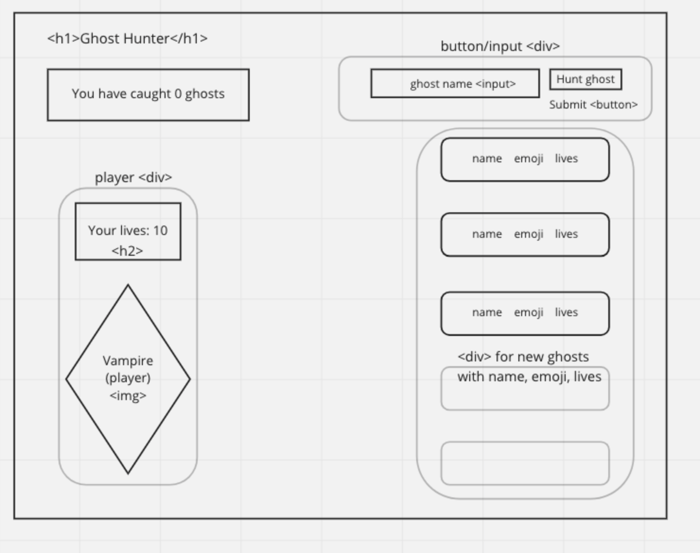

<!-- ## The Golden Rule:

🦸 🦸‍♂️ `Stop starting and start finishing.` 🏁

If you work on more than one feature at a time, you are guaranteed to multiply your bugs and your anxiety.

## Making a plan

1. **Make a drawing of your app. Simple "wireframes"**
1. **Look at the drawing and name the HTML elements you'll need to realize your vision**
1. **Look at the drawing and imagine using the app. What _state_ do you need to track?**
1. **For each HTML element ask: Why do I need this? (i.e., "we need div to display the results in")**
1. **Once we know _why_ we need each element, think about how to implement the "Why" as a "How" (i.e., `resultsEl.textContent = newResults`)**
1. **Find all the 'events' (user clicks, form submit, on load etc) in your app. Ask one by one, "What happens when" for each of these events. Does any state change? Does any DOM update?**
1. **Think about how to validate each of your features according to a Definition of Done. (Hint: console.log usually helps here.)**
1. **Consider what features _depend_ on what other features. Use this dependency logic to figure out what order to complete tasks.**

Additional considerations:

-   Ask: which of your HTML elements need to be hard coded, and which need to be dynamically generated?
-   Consider your data model.
    -   What kinds of objects (i.e., Dogs, Friends, Todos, etc) will you need?
    -   What are the key/value pairs?
    -   What arrays might you need?
    -   What needs to live in a persistence layer?
-   Is there some state we need to initialize?
-   Ask: should any of this work be abstracted into functions? (i.e., is the work complicated? can it be reused?) -->

PLan

## html
input/button
- how player types in new name and submits to create new ghost

div for player: houses the player img and life count tracker el
- lifeCountEl
- img of player

caughtGhosts el
- tracks how many ghosts player has caught

ghost divs: 3 default ghosts
- nameEl
- emojiEl
- lifeCountEl

## state
<!-- player lifeCount
- alert when ghost 'scares' player -->

<!-- ghosts (lifeCount, name, emoji)
 - alerts
 - emoji changes from ghost 👻  to tombstone 🪦 when ghost lives = 0
 - default ghost 'Dearly Departed#1-50' w/ 3 lives -->
 
<!-- caughtGhostsEl counter
 - adds 1 when ghost lives === 0 -->

<!-- ## events 
player clicks hunt ghost button
- new ghost is made w/ default or chosen name, assigned 3 lives
- ghost is pushed into the array -->

player clicks on ghost
- player scares or misses ghost (alert)
- ghost retaliates and scares or misses player (alert)
- lives of whoever is scared goes down, no lives lost if missed
- photo for ghost changes when lives === 0
- player img flips when lives === 0 & game over (alert)

    ## alerts
    - you tried to hit (ghostname) but missed
    - (ghostname) tried to hit you but missed
    - (ghostname) hit you
    - you hit (ghostname)
    - GAME OVER
        --when player lives = 0

## from rubric
- On submitting the 'challenge goblin' form, add a new goblin object (with 3 HP and a name) to state and display it to the DOM
- On clicking a goblin, it should tell the user whether they hit the goblin or not, then update state and DOM appropriately with new HP
- On clicking a goblin, it should tell the user whether the goblin hit the player or not, then update state and DOM appropriately with new HP
- disable everything when GAME OVER!!!!! <<<look up
    Ideas for disabling:
        pointer-events: none;
        disable button;